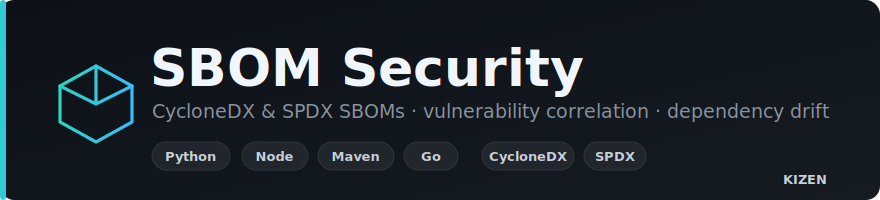

<p align="center">
  
</p>

# SBOM Security

> Generate **CycloneDX** SBOMs, correlate components with known vulnerabilities,
> and track dependency drift across Python, Node, Maven, and Go projects.

[](https://www.python.org/)
[](LICENSE)
[](tests/)

Part of the KIZEN security portfolio. Where the **Secrets Scanner** finds
credentials in code, SBOM Security maps the *dependencies* that code pulls in —
the software supply chain — and the risk they carry. Maps to the AccuKnox
**SBOM / supply-chain security** capability.

**Status:** Phases 1–5 complete (CycloneDX + SPDX across Python, Node, Maven, Go ·
OSV vulnerability correlation · dependency drift & baseline · policy compliance) ·
**Python** 3.10+ · **License** MIT

---

## Why

- **CycloneDX-first.** The OWASP SBOM standard with native vulnerability/VEX
  support — the right base for a *security* SBOM (not just license inventory).
- **purl is the spine.** Every component gets a spec-correct
  [package URL](https://github.com/package-url/purl-spec) (`pkg:pypi/requests@2.31.0`),
  so vulnerability lookup, drift detection, and dedup are trivial and interoperable.
- **Lockfile-first.** Resolved, exact versions from lockfiles — an SBOM should
  record what is actually installed, not a version range.
- **Minimal dependencies.** Pure-stdlib parsing (no `toml`/`requests`); runs on
  Python 3.10+.

---

## Features

- **CycloneDX 1.5 _and_ SPDX 2.3** output — `generate` (stdout or file),
  `--format cyclonedx|spdx`, with metadata and per-component purl, licenses, and
  properties (ecosystem, direct/transitive, scope, source file).
- **Four ecosystems:**
  - **Python** — `requirements*.txt`, `poetry.lock`, `Pipfile.lock`
  - **Node** — `package-lock.json` v1/v2/v3, `yarn.lock` (+ license extraction)
  - **Java** — `pom.xml` (resolves `${...}` properties & scope), `gradle.lockfile`
  - **Go** — `go.mod` (require/`// indirect`), `go.sum`
- **Vulnerability correlation (OSV.dev)** — `audit` queries OSV by purl, attaches
  CVEs with **CVSS score, severity, and fixed-in version** to each component, and
  gates CI with `--fail-on <severity>`. Network errors fail safe (no false
  positives); CycloneDX output gains a `vulnerabilities` array.
- **Dependency drift & baseline** — snapshot a project with `baseline`, then `drift`
  reports **added / removed / upgraded / downgraded** components against it (cross-
  ecosystem version comparison); `--fail-on-drift` gates CI. `audit --baseline`
  reports only **newly-introduced** vulnerabilities, keeping accepted risk quiet.
- **Policy & license compliance** — a YAML policy (`check`) enforces **allowed/denied
  SPDX licenses**, an **unknown-license** mode (allow/warn/deny), **banned packages**
  (by name/ecosystem/version), and a **max vulnerability severity** gate. Any
  error-level violation fails the build.
- **License normalization** — license strings mapped to SPDX IDs (`Apache License,
  Version 2.0` → `Apache-2.0`); unknown values pass through.
- **Direct vs transitive** classification where the lockfile encodes it; a `_merge`
  step lets authoritative files (e.g. `go.mod`) enrich entries from others.
- **Smart walk** — skips `node_modules`, `.venv`, `dist`, `target`, … so the SBOM
  reflects the project's declared dependencies, not re-ingested nested manifests.
- **Dedup** by `(ecosystem, name, version)`.
- **`list-components`** — quick table or JSON inventory.

---

## Install

```bash
git clone https://github.com/Krishcalin/SBOM-Security.git
cd SBOM-Security
pip install -r requirements.txt        # or:  pip install -e ".[test]"
```

`pip install -e .` exposes a `sbom-security` console script (equivalent to
`python main.py`).

---

## Usage

```bash
# Generate a CycloneDX SBOM to stdout
python main.py generate --path .

# ...or to a file, with a custom root-component name
python main.py generate --path . -o sbom.cdx.json --app-name my-app

# Emit SPDX 2.3 instead of CycloneDX
python main.py generate --path . --format spdx -o sbom.spdx.json

# Correlate components with known vulnerabilities (OSV.dev)
python main.py audit --path .
python main.py audit --path . --fail-on high            # CI gate on HIGH+
python main.py audit --path . --format cyclonedx        # SBOM enriched with vulns

# Track dependency drift against a baseline snapshot
python main.py baseline --path . --audit -o sbom-baseline.json
python main.py drift --path . --baseline sbom-baseline.json
python main.py drift --path . --baseline sbom-baseline.json --fail-on-drift
python main.py audit --path . --baseline sbom-baseline.json   # only NEW vulns

# Enforce a license / banned-package / vulnerability policy
python main.py check --path . --policy config/policy.example.yaml
python main.py check --path . --policy policy.yaml --offline   # skip the OSV audit

# Inventory the resolved components
python main.py list-components --path .
python main.py list-components --path . --ecosystem npm
python main.py list-components --path . --format json
```

### Example (CycloneDX component)

```json
{
  "type": "library",
  "name": "requests",
  "version": "2.31.0",
  "purl": "pkg:pypi/requests@2.31.0",
  "bom-ref": "pkg:pypi/requests@2.31.0",
  "properties": [
    { "name": "ecosystem", "value": "pypi" },
    { "name": "direct", "value": "true" },
    { "name": "source", "value": "requirements.txt" }
  ]
}
```

---

## Policy

`check` evaluates the SBOM against a YAML policy
([config/policy.example.yaml](config/policy.example.yaml)). Any `error` fails the
build (exit 1); `warn` does not.

```yaml
licenses:
  allow: []                 # non-empty => allowlist mode
  deny: [GPL-3.0-only, AGPL-3.0-only]
  unknown: warn             # allow | warn | deny
banned_packages:
  - name: event-stream
    ecosystem: npm
    reason: "known-malicious"
vulnerabilities:
  max_severity: high        # anything strictly above 'high' (i.e. critical) fails
```

## How it works

```
walk project tree  →  match files to parsers  →  parse → Components  →  dedup+merge  →  Sbom  →  CycloneDX / SPDX
  skip node_modules/   python · node · maven · go    (purl auto-built)     by key                    JSON
  .venv/dist/target
```

Add an ecosystem by writing a `BaseParser` subclass (declare `FILENAMES`,
implement `parse`) and registering it in `core/engine.py:default_parsers()`.

---

## Project layout

```
SBOM-Security/
├── main.py                     # Click CLI: generate, list-components
├── core/
│   ├── models.py               # Component, Sbom, ComponentType
│   ├── purl.py                 # build_purl() — package URL per ecosystem
│   ├── engine.py               # SbomGenerator — walk, dispatch, dedup+merge
│   ├── cyclonedx.py            # CycloneDX 1.5 serializer
│   ├── spdx.py                 # SPDX 2.3 serializer
│   ├── licenses.py             # license string -> SPDX-ID normalization
│   ├── cvss.py                 # CVSS v3.x base score + severity bucket
│   ├── osv.py                  # OSV.dev client + run_audit() correlation
│   ├── version.py · drift.py · baseline.py   # version compare, diff, snapshot
│   ├── policy.py               # license/package/vuln policy engine
│   ├── banner.py               # CLI banner
│   └── logger.py               # structlog setup
├── parsers/                    # BaseParser + python + node + maven + go
├── config/policy.example.yaml  # policy template
└── tests/                      # 49 pytest tests (test_sbom / test_phase2-5)
```

See [CLAUDE.md](CLAUDE.md) for architecture detail and the full phase roadmap.

---

## Roadmap

| Phase | Scope | Status |
|------:|-------|--------|
| 1 | CycloneDX generation (Python + Node) | ✅ Complete |
| 2 | Maven + Go parsers, license/SPDX-ID normalization, SPDX export | ✅ Complete |
| 3 | Vulnerability correlation (OSV.dev), `audit`, severity gate | ✅ Complete |
| 4 | Dependency drift & baseline (added/removed/upgraded) | ✅ Complete |
| 5 | Policy & license compliance (allow/deny, banned packages) | ✅ Complete |
| 6 | HTML/JSON/CSV reports, pre-commit + CI, GRC mapping (CISA/NTIA/SCVS) | Planned |

---

## Testing

```bash
pytest                # 49 tests
pytest --cov=core --cov=parsers
```

Vulnerability tests inject a fake HTTP layer and make **no real network calls**.

## License

MIT
